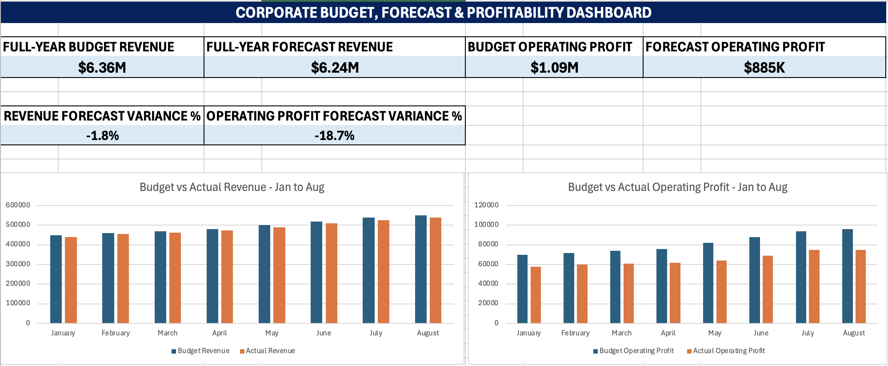

# Corporate Budget, Forecast & Profitability Analysis

## Project Overview

This independent project simulates the work of a junior Financial Analyst supporting a consumer-products company.

The analysis evaluates monthly budget versus actual financial performance, identifies revenue and profitability variances, develops a simple full-year forecast based on year-to-date performance, and summarizes the results in an Excel dashboard.

## Tools Used

- Microsoft Excel
- Excel formulas
- Budget vs Actual Analysis
- Variance Analysis
- Financial Forecasting
- Profitability Analysis
- Dashboard Development

## Analysis Performed

- Compared January–August budget and actual revenue
- Analyzed COGS and operating expense variances
- Calculated gross profit and operating profit
- Evaluated gross margin and operating margin
- Performed YTD budget vs actual variance analysis
- Developed a simple run-rate forecast for September–December
- Estimated full-year revenue and operating profit
- Created an executive-style Excel dashboard

## Key Results

- **Full-Year Budget Revenue:** approximately $6.36M
- **Full-Year Forecast Revenue:** approximately $6.24M
- **Revenue Forecast Variance:** approximately -1.8%
- **Full-Year Budget Operating Profit:** approximately $1.09M
- **Full-Year Forecast Operating Profit:** approximately $885K
- **Operating Profit Forecast Variance:** approximately -18.7%

The analysis indicates that revenue is forecast to finish only modestly below budget, while operating profit is expected to finish significantly below plan because cost pressures are reducing profitability.

## Dashboard

## Excel Workbook

[View / Download the Excel Analysis](Mahadi_Alam_Corporate_Budget_Forecast_Analysis.xlsx)

## Data Note

All financial data used in this project is synthetic and was created solely for portfolio and educational purposes.

The project is intended to demonstrate entry-level budgeting, forecasting, variance analysis, profitability analysis, and Excel dashboard skills.
